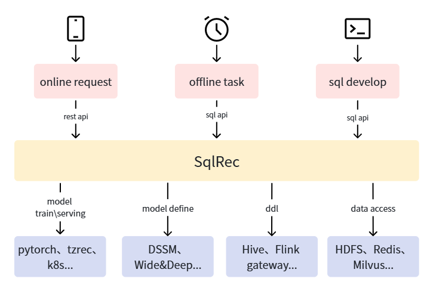

# SQLRec
A recommendation engine that supports SQL-based development. The goal is to enable data scientists, including data analysts, data engineers, and backend developers, to quickly build production-ready recommendation systems. The system architecture is shown in the figure below. SQLRec encapsulates underlying component access, model training, inference, and other processes using SQL, allowing upper-level recommendation business logic to be described using only SQL.



SQLRec has the following features:
- Cloud-native, comes with minikube-based deployment scripts for one-click deployment of the SQLRec system and related dependency services
- Extended SQL syntax, making it possible to describe recommendation system business logic using SQL
- Implemented an efficient SQL execution engine based on Calcite, meeting the real-time requirements of recommendation systems
- Built on existing big data ecosystem, easy to integrate
- Easy to extend, supports custom UDFs, Table types, and Model types

For detailed information, refer to the [SQLRec User Manual](https://sqlrec.github.io/sqlrec).

## Quick Start

### Service Deployment
SQLRec currently supports AMD64 Linux systems, with MacOS support coming later. Note that deployment requires at least 32GB of memory, 256GB of disk space, and a reliable internet connection (if using an accelerator, make sure to use tun mode).

Deploy the SQLRec system with the following commands:
```bash
# clone sqlrec repository
git clone https://github.com/sqlrec/sqlrec.git
cd ./sqlrec/deploy

# deploy minikube
./deploy_minikube.sh

# verify pod status, wait all pod ready
alias kubectl="minikube kubectl --"
kubectl get pod --ALL

# download resource
./download_resource.sh

# deploy sqlrec and dependencies services
./deploy_components.sh

# verify pod status, wait all pod ready
kubectl get pod --ALL

# verify sqlrec service
cd ..
bash ./bin/beeline.sh
```
Notes:
- The minikube-based deployment solution above is for testing only. For production environments, you need to deploy reliable big data infrastructure first, then refer to the scripts under deploy to initialize the database and deploy SQLRec deployment
- If you need to redeploy, you can delete the cluster first via minikube delete
- Some components are not deployed by default, such as kyuubi, jupyter, etc. If needed, you can execute the corresponding deployment scripts in the deploy directory, such as `bash ./kyuubi/deploy.sh`
- You can customize passwords, network ports, and other parameters in env.sh

### Connecting to SQLRec Service

#### Using beeline
SQLRec implements the hive thrift interface, you can use beeline to connect to the SQLRec service and use it like hive.
```bash
bash ./bin/beeline.sh
```

#### Using python
You can use python in Jupyter Notebook to connect to the SQLRec service and use python tools to analyze recommendation data, refer to the following code:
- Use the scripts in the deploy directory to deploy Jupyter
```bash
cd deploy
bash ./jupyter/deploy.sh
# wait pod ready
```
- Open Jupyter Notebook in browser, e.g. `http://127.0.0.1:30280`, and use the account and password in env.sh to login
- Create a new python3 notebook
- Install dependencies
```bash
%pip install pandas
%pip install pyhive
%pip install sasl
%pip install thrift
%pip install thrift-sasl
```
- Connect to SQLRec service and run sql statements
```python
from pyhive import hive
import pandas as pd

conn = hive.Connection(host='192.168.49.2',port=30300,auth='NOSASL')
pd.read_sql("select * from `user_interest_category1` where `user_id` = 1000001", conn)
```

### SQL Development
Execute the `bash ./bin/beeline.sh` command to connect to the SQLRec service, and refer to the following process to develop data tables, SQL functions, API interfaces, etc. needed for recommendations:

1. Initialize data tables. Note that you can get the IP address of the minikube node via the `kubectl get node -o wide` command, you may need to replace IP address below
```sql
SET table.sql-dialect = default;

CREATE TABLE IF NOT EXISTS `user_interest_category1` (
  `user_id` BIGINT,
  `category1` STRING,
  `score` FLOAT,
  PRIMARY KEY (user_id)  NOT ENFORCED
) WITH (
  'connector' = 'redis',
  'data-structure' = 'list',
  'url' = 'redis://192.168.49.2:32379/0'
);

CREATE TABLE IF NOT EXISTS `category1_hot_item` (
  `category1` STRING,
  `item_id` BIGINT,
  `score` FLOAT,
  PRIMARY KEY (category1)  NOT ENFORCED
) WITH (
  'connector' = 'redis',
  'data-structure' = 'list',
  'url' = 'redis://192.168.49.2:32379/0'
);

CREATE TABLE IF NOT EXISTS `user_exposure_item` (
  `user_id` BIGINT,
  `item_id` BIGINT,
  `bhv_time` BIGINT,
  PRIMARY KEY (user_id)  NOT ENFORCED
) WITH (
  'connector' = 'redis',
  'data-structure' = 'list',
  'url' = 'redis://192.168.49.2:32379/0',
  'cache-ttl' = '0'
);

CREATE TABLE IF NOT EXISTS `rec_log_kafka` (
  `user_id` BIGINT,
  `item_id` BIGINT,
  `item_name` STRING,
  `rec_reason` STRING,
  `req_time` BIGINT,
  `req_id` STRING
) WITH (
  'connector' = 'kafka',
  'topic' = 'rec_log',
  'properties.bootstrap.servers' = '192.168.49.2:32092',
  'format' = 'json'
);
```
2. Write test data
```sql
INSERT INTO `user_interest_category1` VALUES
(1000001, 'pc', 100),
(1000001, 'phone', 100);

INSERT INTO `category1_hot_item` VALUES
('pc', 1000001, 100),
('pc', 1000002, 100),
('pc', 1000003, 100),
('pc', 1000004, 100),
('pc', 1000005, 100),
('phone', 1000011, 100),
('phone', 1000012, 100),
('phone', 1000013, 100),
('phone', 1000014, 100),
('phone', 1000015, 100);

select * from `user_interest_category1` where `user_id` = 1000001;

select * from `category1_hot_item` where `category1` = 'pc';
```
3. Develop SQL functions
```sql
-- define function save rec data to kafka and redis
create or replace sql function save_rec_item;

define input table final_recall_item(
  `user_id` BIGINT,
  `item_id` BIGINT,
  `item_name` STRING,
  `rec_reason` STRING,
  `req_time` BIGINT,
  `req_id` STRING
);

insert into rec_log_kafka
select * from final_recall_item;

insert into user_exposure_item
select user_id, item_id, req_time from final_recall_item;

return;


-- define function test rec
create or replace sql function test_rec;

-- define input param
define input table user_info(id bigint);

-- query exposed item for deduplication
cache table exposured_item as
select item_id
from
user_info join user_exposure_item on user_id = user_info.id;

-- query user interest category1
cache table cur_user_interest_category1 as
select category1
from
user_info join user_interest_category1 on user_id = user_info.id
limit 10;

-- query category1 hot item
cache table category1_recall as
select item_id as item_id, 'user_category1_interest_recall:' || cur_user_interest_category1.category1 as rec_reason
from
cur_user_interest_category1 join category1_hot_item
on category1_hot_item.category1 = cur_user_interest_category1.category1
limit 300;

-- dedup category1 recall
cache table dedup_category1_recall as call dedup(category1_recall, exposured_item, 'item_id', 'item_id');

-- truncate to rec item num
cache table final_recall_item as
select item_id, rec_reason
from dedup_category1_recall
limit 2;

-- gen rec meta data
cache table request_meta as select
user_info.id as user_id,
cast(CURRENT_TIMESTAMP as BIGINT) as req_time,
uuid() as req_id
from user_info;

-- gen final rec data
cache table final_rec_data as
select
request_meta.user_id as user_id,
item_id,
cast('XXX' as VARCHAR) as item_name,
rec_reason,
request_meta.req_time as req_time,
request_meta.req_id as req_id
from
request_meta join final_recall_item on 1=1;

-- save rec data to kafka and redis
call save_rec_item(final_rec_data) async;

return final_rec_data;
```
The SQL above defines the recommendation function test_rec. You can see the SQL function definition syntax is:
- Start with `create or replace sql function` followed by the function name
- `define input table` defines input parameters, which can be empty or define multiple
- `cache table` caches intermediate calculation results, can cache execution results of SELECT statements and SQL function calls
- `call` calls other functions, can call asynchronously via the async keyword
- `return` returns calculation results, can be empty


You can test the function directly in the beeline command line as shown below
```sql
0: jdbc:hive2://192.168.49.2:30300/default> cache table t1 as select cast(1000001 as bigint) as id;
+-------------+--------+
| table_name  | count  |
+-------------+--------+
| t1          | 1      |
+-------------+--------+
1 row selected (0.006 seconds)
0: jdbc:hive2://192.168.49.2:30300/default> desc t1;
+-------+---------+
| name  |  type   |
+-------+---------+
| id    | BIGINT  |
+-------+---------+
1 row selected (0.002 seconds)
0: jdbc:hive2://192.168.49.2:30300/default> call test_rec(t1);
+----------+----------+------------+---------------------------------------+----------------+---------------------------------------+
| user_id  | item_id  | item_name  |              rec_reason               |    req_time    |                req_id                 |
+----------+----------+------------+---------------------------------------+----------------+---------------------------------------+
| 1000001  | 1000015  | XXX        | user_category1_interest_recall:phone  | 1775366030516  | ee073e63-b74a-4c7e-8fea-60459729099c  |
| 1000001  | 1000005  | XXX        | user_category1_interest_recall:pc     | 1775366030516  | ee073e63-b74a-4c7e-8fea-60459729099c  |
+----------+----------+------------+---------------------------------------+----------------+---------------------------------------+
2 rows selected (0.006 seconds)
0: jdbc:hive2://192.168.49.2:30300/default> call test_rec(t1);
+----------+----------+------------+---------------------------------------+----------------+---------------------------------------+
| user_id  | item_id  | item_name  |              rec_reason               |    req_time    |                req_id                 |
+----------+----------+------------+---------------------------------------+----------------+---------------------------------------+
| 1000001  | 1000014  | XXX        | user_category1_interest_recall:phone  | 1775366045908  | 37116c4c-9e7e-4dcc-9913-14f9628a8467  |
| 1000001  | 1000004  | XXX        | user_category1_interest_recall:pc     | 1775366045908  | 37116c4c-9e7e-4dcc-9913-14f9628a8467  |
+----------+----------+------------+---------------------------------------+----------------+---------------------------------------+
2 rows selected (0.003 seconds)
```
You can see that recall, recommendation reasons, and deduplication are all working.

4. Create API Interface
Refer to the following SQL to expose the SQL function as an API interface:
```sql
create or replace api test_rec with test_rec;
```
### Recommendation Testing
Use the following command for recommendation testing:
```bash
yi@debian12:~$ curl -X POST http://192.168.49.2:30301/api/v1/test_rec \
-H "Content-Type: application/json" \
-d '{"inputs":{"user_info":[{"id": 1000001}]}}'
{"data":[{"user_id":1000001,"item_id":1000013,"item_name":"XXX","rec_reason":"user_category1_interest_recall:phone","req_time":1775367428357,"req_id":"f014bd2d-41f8-4de5-93e0-3507cdae2542"},{"user_id":1000001,"item_id":1000003,"item_name":"XXX","rec_reason":"user_category1_interest_recall:pc","req_time":1775367428357,"req_id":"f014bd2d-41f8-4de5-93e0-3507cdae2542"}]}
````

## Performance Testing
There are test scripts in the benchmark directory. You can refer to the following commands for testing:
```bash
bash init.sh
bash benchmark.sh
```
The default test configuration is as follows:
- 100K users, 100K items data
- The recommendation process includes 4 recall paths: global hot items, user interest category hot items, itemcf, vector retrieval (8 dimensions, user embedding fixed), as well as exposure deduplication and category diversification
- Test a single SQLRec instance with 10 concurrent connections

Test results on AMD Ryzen 5600H, 32GB DDR4 memory machine:
```
  Thread Stats   Avg      Stdev     Max   +/- Stdev
    Latency     9.23ms    5.04ms  48.96ms   90.50%
    Req/Sec   111.59     17.07   151.00     59.47%
  33370 requests in 30.02s, 57.91MB read
  Socket errors: connect 0, read 33369, write 0, timeout 0
Requests/sec:   1111.47
Transfer/sec:      1.93MB
```

## Roadmap
### When will version 1.0 be released
Versions before 1.0 are beta versions, not recommended for production use, and interface compatibility is not guaranteed. There is no planned release date yet. It will be released after the following features are completed:
- Comprehensive unit test, integration test, and effectiveness test coverage
- Code quality optimization, many details still need to be polished
- Support for degradation and timeout configuration
- Complete version management method, easy to roll back to previous versions
- Metric monitoring system improvement
- C++ model serving

### Future Feature Planning
- Frontend UI for viewing current execution DAG, SQL code, statistics, etc.
- Further optimize SQL syntax compatibility and runtime performance
- More ready-to-use UDFs, models, etc.
- Support for more external data sources, such as JDBC, MongoDB, etc.
- Tensorboard visualization of model training process
- GPU training and inference support
- Support for authentication and authorization
- Best practice tutorials, including search, recommendation, etc.
