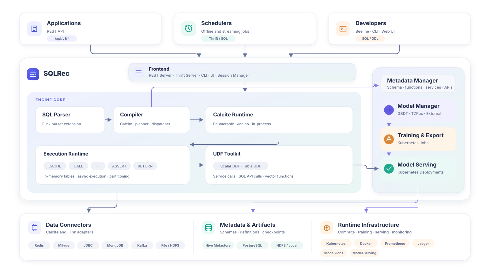

<h1 align="center">SQLRec</h1>

<p align="center">
  English | <a href="README_zh.md">中文</a>
</p>

<p align="center">
  <a href="https://github.com/sqlrec/sqlrec/blob/main/LICENSE">
    
  </a>
  <a href="https://github.com/sqlrec/sqlrec/stargazers">
    
  </a>
  <a href="https://github.com/sqlrec/sqlrec/network/members">
    
  </a>
  <a href="https://github.com/sqlrec/sqlrec/commits">
    
  </a>
</p>

A recommendation engine that supports SQL-based development. The goal is to enable data scientists, including data analysts, data engineers, and backend developers, to quickly build production-ready recommendation systems. The system architecture is shown in the figure below. SQLRec encapsulates underlying component access, model training, inference, and other processes using SQL, allowing upper-level recommendation business logic to be described using only SQL.



SQLRec has the following features:
- Cloud-native, comes with minikube-based deployment scripts for one-click deployment of the SQLRec system and related dependency services
- Extended SQL syntax, making it possible to describe recommendation system business logic using SQL
- Implemented an efficient SQL execution engine based on Calcite, meeting the real-time requirements of recommendation systems
- Built on existing big data ecosystem, easy to integrate
- Easy to extend, supports custom UDFs, Table types, and Model types

For detailed information, refer to the [SQLRec User Manual](https://sqlrec.github.io/sqlrec/en/).

## Quick Start

### Run the Dependency-Free Docker Demo (Recommended)

The demo image includes the `demo_rec` API, its SQL function, and three `demo_`-prefixed filesystem tables. Data is written directly to process memory, so this path does not require Redis, PostgreSQL, Hive Metastore, Flink, Kubernetes, or any other external component.

```bash
docker run --rm -d --name sqlrec-demo \
  -p 30000:30000 \
  -p 30001:30001 \
  sqlrec/sqlrec-demo:latest
```

After the service starts, open the CLI, insert test data, and call the recommendation function:

```bash
docker exec -it sqlrec-demo bash /app/cli.sh
```

```sql
insert into demo_user_interest_category values (1000001, 'pc', 100);
insert into demo_category_hot_item values
  ('pc', 1000001, 100),
  ('pc', 1000002, 90);
cache table quick_start_user as select cast(1000001 as bigint) as user_id;
call demo_rec(quick_start_user);
```

The demo enables its SQL API by default. Since the CLI and HTTP service have separate in-memory data, insert test data into the HTTP process before calling the recommendation API:

```bash
curl -X POST http://localhost:30001/sql/v1 \
  -H "Content-Type: application/json" \
  -d @- <<'JSON'
{"sqls":["insert into demo_user_interest_category values (1000001, 'pc', 100)","insert into demo_category_hot_item values ('pc', 1000001, 100), ('pc', 1000002, 90)"]}
JSON

curl -X POST http://localhost:30001/api/v1/demo_rec \
  -H "Content-Type: application/json" \
  -d '{"data":{"user_info":[{"user_id":1000001}]}}'
```

Open the UI at [http://localhost:30001/ui/static/index.html](http://localhost:30001/ui/static/index.html). CLI data is discarded when that process exits, while HTTP service data remains until the container stops. Run `docker stop sqlrec-demo` when finished.

Local metadata mode does not accept DDL statements from either the CLI or SQL API. Define tables, functions, and APIs in SQL files and mount their directory into the container with `SQL_SCHEMA_DIR` pointing to it, or deploy the complete cluster to execute DDL interactively.

See the [Quick Start guide](https://sqlrec.github.io/sqlrec/en/docs/quick_start) for the table layout and more SQL examples.

### Full Service Deployment (Optional)
The steps below deploy persistent metadata and the external data, compute, and model infrastructure used by the complete examples. After deployment, you can reproduce the exact same quick-start tables, SQL function, and API as the Docker demo above.

SQLRec supports AMD64 Linux and Apple Silicon macOS 14 or later. Linux uses the Minikube Docker driver. macOS uses Minikube 1.37+ with the vfkit driver, vmnet-shared networking, and VirtioFS mounts. The deployment requires at least 32GB of memory, 256GB of disk space, and a reliable internet connection (if using an accelerator, make sure to use tun mode).

On macOS, the deployment script installs missing command-line dependencies with Homebrew (Docker Desktop is not required). The equivalent command is:

```bash
brew install minikube vfkit docker docker-buildx helm gettext libpq
```

The script also configures the Homebrew Buildx plugin and installs `vmnet-helper` using the version-specific procedure from the [Minikube vfkit documentation](https://minikube.sigs.k8s.io/docs/drivers/vfkit/).

Deploy the SQLRec system with the following commands:
```bash
# clone sqlrec repository
git clone https://github.com/sqlrec/sqlrec.git
cd ./sqlrec/deploy

# deploy minikube
./deploy_minikube.sh

# verify pod status, wait all pod ready
alias kubectl="minikube kubectl --"
kubectl get pods --all-namespaces

# download resource
./download_resource.sh

# deploy sqlrec and dependencies services
./deploy_components.sh

# verify pod status, wait all pod ready
kubectl get pods --all-namespaces

# verify sqlrec service
cd ..
bash ./bin/beeline.sh
```
Notes:
- The minikube-based deployment solution above is for testing only. For production environments, you need to deploy reliable big data infrastructure first, then refer to the scripts under deploy to initialize the database and deploy SQLRec deployment
- If you need to redeploy, you can delete the cluster first via minikube delete
- Workload images are saved under `deploy/data/image-cache/<arch>` after a successful deployment and loaded into a newly created cluster automatically
- Some components are not deployed by default, such as kyuubi, jupyter, etc. If needed, you can execute the corresponding deployment scripts in the deploy directory, such as `bash ./kyuubi/deploy.sh`
- You can customize passwords, network ports, and other parameters in env.sh

### Connecting to SQLRec Service

SQLRec implements the hive thrift interface, you can use beeline to connect to the SQLRec service and use it like hive.
```bash
bash ./bin/beeline.sh
```

### SQL Development

Run `bash ./bin/beeline.sh` to connect to SQLRec. The table names, field names, SQL function name, and API name below match the quick-start example in the `sqlrec/sqlrec-demo` image. Their source definitions are under [`sqlrec-demo/src/main/sql/quick_start/`](sqlrec-demo/src/main/sql/quick_start/).

1. Create the three quick-start tables:

```sql
SET table.sql-dialect = default;

CREATE TABLE IF NOT EXISTS `demo_user_interest_category` (
  `user_id` BIGINT,
  `category` STRING,
  `score` FLOAT,
  PRIMARY KEY (user_id) NOT ENFORCED
) WITH (
  'connector' = 'filesystem'
);

CREATE TABLE IF NOT EXISTS `demo_category_hot_item` (
  `category` STRING,
  `item_id` BIGINT,
  `score` FLOAT,
  PRIMARY KEY (item_id) NOT ENFORCED
) WITH (
  'connector' = 'filesystem'
);

CREATE TABLE IF NOT EXISTS `demo_exposure_item` (
  `user_id` BIGINT,
  `item_id` BIGINT,
  `bhv_time` BIGINT,
  PRIMARY KEY (item_id) NOT ENFORCED
) WITH (
  'connector' = 'filesystem'
);
```

The `filesystem` connector is intentional: it keeps this example semantically identical to the demo image. Table data remains in the SQLRec service process, while the cluster persists metadata. Use a persistent connector such as Redis for production data.

2. Insert test data:

```sql
INSERT INTO `demo_user_interest_category` VALUES
(1000001, 'pc', 100);

INSERT INTO `demo_category_hot_item` VALUES
('pc', 1000001, 100),
('pc', 1000002, 90);
```
3. Create the same `demo_rec` SQL function used by the demo image:

```sql
create or replace sql function demo_rec;

define input table user_info(user_id bigint);

cache table exposed_item as
select item_id
from user_info join demo_exposure_item
on demo_exposure_item.user_id = user_info.user_id;

cache table cur_user_interest_category as
select category
from user_info join demo_user_interest_category
on demo_user_interest_category.user_id = user_info.user_id
limit 10;

cache table category_recall as
select
  item_id,
  'user_category_interest_recall:' || cur_user_interest_category.category as rec_reason
from cur_user_interest_category join demo_category_hot_item
on demo_category_hot_item.category = cur_user_interest_category.category
limit 300;

cache table dedup_category_recall as
call dedup(category_recall, exposed_item, 'item_id', 'item_id');

-- truncate to rec item num
cache table final_recall_item as
select item_id, rec_reason
from dedup_category_recall
limit 2;

-- gen rec meta data
cache table request_meta as
select
  user_info.user_id,
  cast(CURRENT_TIMESTAMP as BIGINT) as req_time,
  uuid() as req_id
from user_info;

-- gen final rec data
cache table final_rec_data as
select
  request_meta.user_id as user_id,
  item_id,
  cast('XXX' as VARCHAR) as item_name,
  rec_reason,
  request_meta.req_time as req_time,
  request_meta.req_id as req_id
from request_meta join final_recall_item on 1=1;

-- write exposed item to exposure table for deduplication
insert into demo_exposure_item
select user_id, item_id, req_time
from final_rec_data;

return final_rec_data;
```
This function recalls hot items from the user's preferred categories, removes exposed items, and records the new exposures. Verify it with:

```sql
cache table quick_start_user as select cast(1000001 as bigint) as user_id;
call demo_rec(quick_start_user);
```

4. Expose the SQL function as an API with the same name:

```sql
create or replace api demo_rec with demo_rec;
```

### Recommendation Testing

Get the minikube node IP, then call `demo_rec`:

```bash
MINIKUBE_NODE_IP=$(kubectl get node -o jsonpath='{.items[0].status.addresses[?(@.type=="InternalIP")].address}')
curl -X POST "http://${MINIKUBE_NODE_IP}:30001/api/v1/demo_rec" \
  -H "Content-Type: application/json" \
  -d '{"data":{"user_info":[{"user_id":1000001}]}}'
```

### Frontend UI
SQLRec provides a web-based frontend UI for monitoring and management. You can access it at `http://192.168.49.2:30001/ui/static/index.html` (replace the IP address with your minikube node IP).

The frontend UI allows you to:
- View SQL functions and their execution DAG (Directed Acyclic Graph)
- Browse API configurations
- Monitor model training status and checkpoints
- View service statistics and metrics

## Performance Testing

The benchmark uses the MovieLens-1M dataset, and its scripts are located in `benchmark/movielens/`. Initialize the environment and run the benchmark with:

```bash
cd benchmark/movielens
bash init.sh
bash benchmark.sh
```

The default dataset and recommendation pipeline are as follows:

- MovieLens-1M: 6,040 users, 3,706 movies, and approximately 1 million rating records
- The benchmark exercises the `main_rec` pipeline with four recall paths: global hot items, user-interest genre hot items, ItemCF, and Milvus vector search, each recalling up to 300 items
- Vectors have 64 dimensions; because the recall model service is disabled for this benchmark, `random_vec` generates a user vector for each request
- Recall is followed by one-hour exposure deduplication, `rank_fun_simple` ranking, and genre diversification; the pipeline returns 10 results, writes recommendation logs to Kafka asynchronously, and records the exposures
- A single SQLRec instance is tested: one thread and one connection warm up the system for 10 seconds, followed by a 30-second run with 10 threads and 10 connections

Results on AMD Ryzen 5600H, 32GB DDR4, Debian 12, and Minikube:

```
  Thread Stats   Avg      Stdev     Max   +/- Stdev
    Latency     6.73ms    3.16ms  90.29ms   94.46%
    Req/Sec   151.20     16.58   191.00     73.67%
  45231 requests in 30.02s, 87.90MB read
Requests/sec:   1506.47
Transfer/sec:      2.93MB
```

## Roadmap
### When will version 1.0 be released
Versions before 1.0 are beta versions, not recommended for production use, and interface compatibility is not guaranteed. There is no planned release date yet. It will be released after the following features are completed:
- Comprehensive unit test, integration test, and effectiveness test coverage
- Code quality optimization, many details still need to be polished
- Support for degradation and timeout configuration
- Complete version management method, easy to roll back to previous versions
- Metric monitoring system improvement
- C++ model serving

### Future Feature Planning
- Frontend UI for viewing current execution DAG, SQL code, statistics, etc.
- Further optimize SQL syntax compatibility and runtime performance
- More ready-to-use UDFs, models, etc.
- Support for more external data sources, such as JDBC, MongoDB, etc.
- Tensorboard visualization of model training process
- GPU training and inference support
- Support for authentication and authorization
- Best practice tutorials, including search, recommendation, etc.
