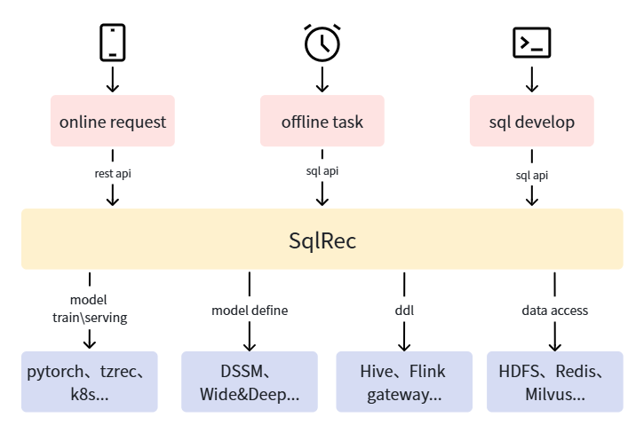

<h1 align="center">SQLRec</h1>

<p align="center">
  <a href="README.md">English</a> | 中文
</p>

<p align="center">
  <a href="https://github.com/sqlrec/sqlrec/blob/main/LICENSE">
    
  </a>
  <a href="https://github.com/sqlrec/sqlrec/stargazers">
    
  </a>
  <a href="https://github.com/sqlrec/sqlrec/network/members">
    
  </a>
  <a href="https://github.com/sqlrec/sqlrec/commits">
    
  </a>
</p>

一个支持使用SQL进行开发的推荐引擎，目标是让懂数据科学的人，包括数据分析师、数据工程师、后端开发等，都能快速搭建生产可用的推荐系统。系统架构参考下图，SQLRec将底层的组件访问、模型训练、推理等流程使用SQL封装，上层推荐业务逻辑仅使用SQL进行描述即可。



sqlRec有以下特点：

- 云原生，自带基于minikube的部署脚本，可以一键部署SQLRec系统和相关的依赖服务
- 扩展了SQL语法，让使用SQL描述推荐系统业务逻辑变得可能
- 基于calcite实现了一个高效的SQL执行引擎，可以满足推荐系统的实时性要求
- 基于已有的大数据生态，接入简单
- 易于扩展，可以自定义UDF、Table类型、Model类型

详细的资料参考[SQLRec用户手册](https://sqlrec.github.io/sqlrec)。

## 快速开始

### 直接运行无外部依赖的 Docker Demo（推荐）

Demo 镜像已经内置 `test_rec` API、SQL 函数和三张 filesystem 表。数据直接写入进程内存，因此不需要 Redis、PostgreSQL、Hive Metastore、Flink、Kubernetes 或其他外部组件。

```bash
docker run --rm -d --name sqlrec-demo \
  -p 30000:30000 \
  -p 30001:30001 \
  sqlrec/sqlrec-demo:latest
```

服务启动后，进入 CLI，写入测试数据并调用推荐函数：

```bash
docker exec -it sqlrec-demo bash /app/cli.sh
```

```sql
insert into user_interest_category1 values (1000001, 'pc', 100);
insert into category1_hot_item values
  ('pc', 1000001, 100),
  ('pc', 1000002, 90);
cache table quick_start_user as select cast(1000001 as bigint) as id;
call test_rec(quick_start_user);
```

Demo 默认开启 SQL API。由于 CLI 与 HTTP 服务使用不同的内存数据，需要先向 HTTP 进程写入测试数据，再调用推荐 API：

```bash
curl -X POST http://localhost:30001/sql/v1 \
  -H "Content-Type: application/json" \
  -d @- <<'JSON'
{"sqls":["insert into user_interest_category1 values (1000001, 'pc', 100)","insert into category1_hot_item values ('pc', 1000001, 100), ('pc', 1000002, 90)"]}
JSON

curl -X POST http://localhost:30001/api/v1/test_rec \
  -H "Content-Type: application/json" \
  -d '{"data":{"user_info":[{"id":1000001}]}}'
```

可以打开 [http://localhost:30001/ui/static/index.html](http://localhost:30001/ui/static/index.html) 查看 UI。CLI 数据会在该进程退出时清除，HTTP 服务的数据会保留到容器停止。体验完成后执行 `docker stop sqlrec-demo`。

本地元数据模式不允许通过 CLI 或 SQL API 执行 DDL。表、函数和 API 等定义需要写入本地 SQL 文件，将其目录挂载到容器并通过 `SQL_SCHEMA_DIR` 指向该目录；也可以部署完整集群后直接执行 DDL。

表目录和更多 SQL 示例请参考[快速开始文档](https://sqlrec.github.io/sqlrec/docs/quick_start)。

### 完整服务部署（可选）

下面的步骤会部署持久化元数据，以及完整示例使用的外部数据和模型服务；它与上面的无外部依赖 Docker Demo 是两条独立的体验路径。

SQLRec目前支持AMD64的Linux系统，后续会支持MacOS。注意，部署需要至少32GB的内存、256GB磁盘空间、可靠的互联网连接（如果使用加速器，注意使用tun模式）。

按下述命令部署SQLRec系统：

```bash
# clone sqlrec repository
git clone https://github.com/sqlrec/sqlrec.git
cd ./sqlrec/deploy

# deploy minikube
./deploy_minikube.sh

# verify pod status, wait all pod ready
alias kubectl="minikube kubectl --"
kubectl get pod --ALL

# download resource
./download_resource.sh

# deploy sqlrec and dependencies services
./deploy_components.sh

# verify pod status, wait all pod ready
kubectl get pod --ALL

# verify sqlrec service
cd ..
bash ./bin/beeline.sh
```

注意：

- 上述基于minikube的部署方案仅用于测试，生产环境需要先部署可靠的大数据基础设施，然后参考deploy下的脚本初始化数据库、部署SQLRec deployment
- 如果需要重新部署，可以先通过minikube delete删除集群
- 有一些组件没有默认部署，比如kyuubi、jupyter等，如果需要，可以在deploy目录执行对应的部署脚本，比如`bash ./kyuubi/deploy.sh`
- 可以在env.sh自定义密码、网络端口等参数

### 连接SQLRec服务

SQLRec实现了hive thrift接口，你可以使用beeline连接SQLRec服务，然后像使用hive一样使用它。

```bash
bash ./bin/beeline.sh
```

### SQL开发

执行`bash ./bin/beeline.sh`命令连接SQLRec服务，参考下述流程开发推荐需要的数据表、SQL函数、API接口等：

1.初始化数据表，注意可以通过`kubectl get node -o wide`命令获取minikube节点的ip地址，你可能需要替换下述代码的ip地址

```sql
SET table.sql-dialect = default;

CREATE TABLE IF NOT EXISTS `user_interest_category1` (
  `user_id` BIGINT,
  `category1` STRING,
  `score` FLOAT,
  PRIMARY KEY (user_id)  NOT ENFORCED
) WITH (
  'connector' = 'redis',
  'data-structure' = 'list',
  'url' = 'redis://192.168.49.2:30017/0'
);

CREATE TABLE IF NOT EXISTS `category1_hot_item` (
  `category1` STRING,
  `item_id` BIGINT,
  `score` FLOAT,
  PRIMARY KEY (category1)  NOT ENFORCED
) WITH (
  'connector' = 'redis',
  'data-structure' = 'list',
  'url' = 'redis://192.168.49.2:30017/0'
);

CREATE TABLE IF NOT EXISTS `exposure_item` (
  `user_id` BIGINT,
  `item_id` BIGINT,
  `bhv_time` BIGINT,
  PRIMARY KEY (user_id)  NOT ENFORCED
) WITH (
  'connector' = 'redis',
  'data-structure' = 'list',
  'url' = 'redis://192.168.49.2:30017/0',
  'cache-ttl' = '0'
);

```

1. 写入测试数据

```sql
INSERT INTO `user_interest_category1` VALUES
(1000001, 'pc', 100),
(1000001, 'phone', 100);

INSERT INTO `category1_hot_item` VALUES
('pc', 1000001, 100),
('pc', 1000002, 100),
('pc', 1000003, 100),
('pc', 1000004, 100),
('pc', 1000005, 100),
('phone', 1000011, 100),
('phone', 1000012, 100),
('phone', 1000013, 100),
('phone', 1000014, 100),
('phone', 1000015, 100);

select * from `user_interest_category1` where `user_id` = 1000001;

select * from `category1_hot_item` where `category1` = 'pc';
```

3.开发sql函数

```sql
-- define function test rec
create or replace sql function test_rec;

-- define input param
define input table user_info(id bigint);

-- query exposed item for deduplication
cache table exposured_item as
select item_id
from
user_info join exposure_item on user_id = user_info.id;

-- query user interest category1
cache table cur_user_interest_category1 as
select category1
from
user_info join user_interest_category1 on user_id = user_info.id
limit 10;

-- query category1 hot item
cache table category1_recall as
select item_id as item_id, 'user_category1_interest_recall:' || cur_user_interest_category1.category1 as rec_reason
from
cur_user_interest_category1 join category1_hot_item
on category1_hot_item.category1 = cur_user_interest_category1.category1
limit 300;

-- dedup category1 recall
cache table dedup_category1_recall as call dedup(category1_recall, exposured_item, 'item_id', 'item_id');

-- truncate to rec item num
cache table final_recall_item as
select item_id, rec_reason
from dedup_category1_recall
limit 2;

-- gen rec meta data
cache table request_meta as select
user_info.id as user_id,
cast(CURRENT_TIMESTAMP as BIGINT) as req_time,
uuid() as req_id
from user_info;

-- gen final rec data
cache table final_rec_data as
select
request_meta.user_id as user_id,
item_id,
cast('XXX' as VARCHAR) as item_name,
rec_reason,
request_meta.req_time as req_time,
request_meta.req_id as req_id
from
request_meta join final_recall_item on 1=1;

-- write exposed item to exposure table for deduplication
insert into exposure_item
select user_id, item_id, req_time
from final_rec_data;

return final_rec_data;
```

上面SQL定义了推荐函数test\_rec，可以发现SQL函数定义语法是：

- `create or replace sql function`加函数名开头
- `define input table`定义输入参数，可以为空或者定义多个
- `cache table`缓存中间计算结果，可以缓存SELECT语句、SQL函数调用的执行结果
- `call`调用其他函数, 可以通过async关键字异步调用
- `return`返回计算结果，可以为空

可以直接在beeline命令行测试函数，如下所示

```sql
0: jdbc:hive2://192.168.49.2:30000/default> cache table t1 as select cast(1000001 as bigint) as id;
+-------------+--------+
| table_name  | count  |
+-------------+--------+
| t1          | 1      |
+-------------+--------+
1 row selected (0.006 seconds)
0: jdbc:hive2://192.168.49.2:30000/default> desc t1;
+-------+---------+
| name  |  type   |
+-------+---------+
| id    | BIGINT  |
+-------+---------+
1 row selected (0.002 seconds)
0: jdbc:hive2://192.168.49.2:30000/default> call test_rec(t1);
+----------+----------+------------+---------------------------------------+----------------+---------------------------------------+
| user_id  | item_id  | item_name  |              rec_reason               |    req_time    |                req_id                 |
+----------+----------+------------+---------------------------------------+----------------+---------------------------------------+
| 1000001  | 1000015  | XXX        | user_category1_interest_recall:phone  | 1775366030516  | ee073e63-b74a-4c7e-8fea-60459729099c  |
| 1000001  | 1000005  | XXX        | user_category1_interest_recall:pc     | 1775366030516  | ee073e63-b74a-4c7e-8fea-60459729099c  |
+----------+----------+------------+---------------------------------------+----------------+---------------------------------------+
2 rows selected (0.006 seconds)
0: jdbc:hive2://192.168.49.2:30000/default> call test_rec(t1);
+----------+----------+------------+---------------------------------------+----------------+---------------------------------------+
| user_id  | item_id  | item_name  |              rec_reason               |    req_time    |                req_id                 |
+----------+----------+------------+---------------------------------------+----------------+---------------------------------------+
| 1000001  | 1000014  | XXX        | user_category1_interest_recall:phone  | 1775366045908  | 37116c4c-9e7e-4dcc-9913-14f9628a8467  |
| 1000001  | 1000004  | XXX        | user_category1_interest_recall:pc     | 1775366045908  | 37116c4c-9e7e-4dcc-9913-14f9628a8467  |
+----------+----------+------------+---------------------------------------+----------------+---------------------------------------+
2 rows selected (0.003 seconds)
```

可以发现，召回、推荐理由、去重都已经生效。

1. 创建API接口
   参考下述SQL将SQL函数暴露为API接口：

```sql
create or replace api test_rec with test_rec;
```

### 推荐测试

使用下述命令进行推荐测试：

```bash
yi@debian12:~$ curl -X POST http://192.168.49.2:30001/api/v1/test_rec \
-H "Content-Type: application/json" \
-d '{"data":{"user_info":[{"id": 1000001}]}}'
{"data":[{"user_id":1000001,"item_id":1000013,"item_name":"XXX","rec_reason":"user_category1_interest_recall:phone","req_time":1775367428357,"req_id":"f014bd2d-41f8-4de5-93e0-3507cdae2542"},{"user_id":1000001,"item_id":1000003,"item_name":"XXX","rec_reason":"user_category1_interest_recall:pc","req_time":1775367428357,"req_id":"f014bd2d-41f8-4de5-93e0-3507cdae2542"}]}
```

### 前端UI

SQLRec提供了基于Web的前端UI，用于监控和管理。你可以通过 `http://192.168.49.2:30001/ui/static/index.html` 访问（请将IP地址替换为你的minikube节点IP）。

前端UI可以让你：
- 查看SQL函数及其执行DAG（有向无环图）
- 浏览API配置
- 监控模型训练状态和检查点
- 查看服务统计信息和指标

## 性能测试

性能测试基于 MovieLens-1M 数据集，脚本位于 `benchmark/movielens/` 目录。执行以下命令初始化测试环境并运行压测：

```bash
cd benchmark/movielens
bash init.sh
bash benchmark.sh
```

默认的测试数据和推荐流程如下：

- MovieLens-1M 数据集：6040 个用户、3706 部电影、约 100 万条评分记录
- 测试 `main_rec` 推荐流程，包含 4 路召回：全局高热、用户兴趣类目高热、ItemCF 和 Milvus 向量检索，每路最多召回 300 条
- 向量维度为 64；本测试未启用召回模型服务，每次请求通过 `random_vec` 生成用户向量
- 召回后进行近 1 小时曝光去重、`rank_fun_simple` 排序和类目打散，最终返回 10 条结果；推荐日志异步写入 Kafka，同时记录曝光结果
- 单 SQLRec 实例部署；先以 1 线程、1 连接预热 10 秒，再以 10 线程、10 连接压测 30 秒

在 AMD Ryzen 5600H、32GB DDR4 内存、Debian 12 和 Minikube 环境下的测试结果如下：

```
  Thread Stats   Avg      Stdev     Max   +/- Stdev
    Latency     6.73ms    3.16ms  90.29ms   94.46%
    Req/Sec   151.20     16.58   191.00     73.67%
  45231 requests in 30.02s, 87.90MB read
Requests/sec:   1506.47
Transfer/sec:      2.93MB
```

## 路线图

### 1.0版本什么时候发布

1.0之前版本都是beta版本，不建议线上使用，不保证接口兼容性。目前无规划发布时间，将在下述功能完善后发布：

- 完善的单元测试、集成测试、效果测试覆盖
- 优化代码质量，目前仍很多细节要打磨
- 支持降级和超时配置
- 完善的版本管理方法，可以方便回滚到之前的版本
- metric监控系统完善
- c++模型serving

### 后续功能规划

- 前端UI，用于查看当前执行DAG、SQL代码、统计信息等
- 进一步优化SQL语法兼容性、运行性能
- 更多开箱可用的UDF、模型等
- 支持更多的外部数据源，比如JDBC、MongoDB等
- Tensorboard可视化模型训练过程
- GPU训练、推理支持
- 支持认证、鉴权
- 最佳实践教程，包括搜索、推荐等

