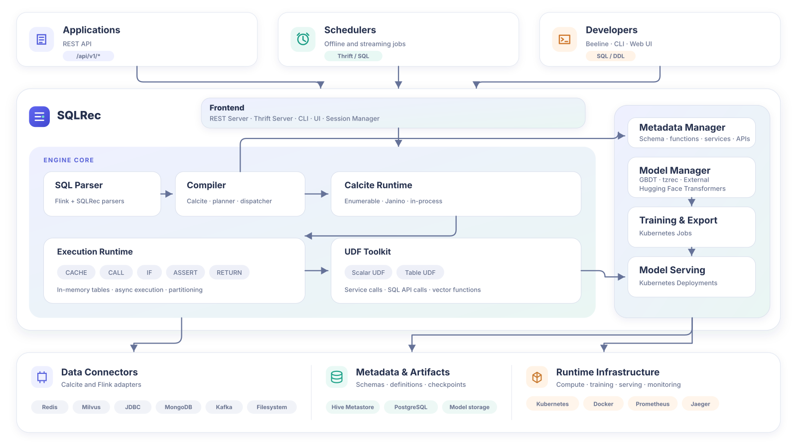

<h1 align="center">SQLRec</h1>

<p align="center">
  <a href="README.md">English</a> | 中文
</p>

<p align="center">
  <a href="https://github.com/sqlrec/sqlrec/blob/main/LICENSE">
    
  </a>
  <a href="https://github.com/sqlrec/sqlrec/stargazers">
    
  </a>
  <a href="https://github.com/sqlrec/sqlrec/network/members">
    
  </a>
  <a href="https://github.com/sqlrec/sqlrec/commits">
    
  </a>
</p>

## 项目介绍

SQLRec 是一个用 SQL 开发推荐系统的引擎，让熟悉 SQL 的开发人员编写召回、去重、排序和打散等业务逻辑，并将流程发布为 HTTP API。数据源访问、模型训练与推理由引擎统一封装，用户可以聚焦推荐逻辑。

当前版本为 beta，不建议用于生产环境，也不保证接口兼容性。

## 项目优势

- **开发简单**：用 SQL 编写召回、排序等推荐逻辑，并发布为 API。
- **面向在线推荐**：基于 Calcite 执行 SQL，支持缓存、并发和超时降级。
- **复用大数据生态**：可直接使用 HMS 中的表和 HDFS 上的数据。
- **统一模型管理**：通过 SQL 训练、部署和调用模型，也可接入已有模型服务。
- **云原生**：基于 Kubernetes 管理训练和推理，提供部署脚本。
- **易于扩展**：支持自定义函数、数据源和模型后端。
- **便于排障**：通过 UI、指标和 Trace 查看流程、定位问题。

## 系统架构



组件职责和执行机制见[架构设计](https://sqlrec.github.io/sqlrec/docs/reference/architecture)。

## 快速体验

Docker Demo 内置示例数据、推荐流程和 API，仅用于体验功能，无需部署外部服务。实际业务接入需要自行定义连接业务数据的表、SQL 推荐流程和 API，再根据业务需要配置模型服务及部署环境。

使用 Docker 启动 Demo：

```bash
docker run --rm -d --name sqlrec-demo \
  -p 30000:30000 \
  -p 30001:30001 \
  sqlrec/sqlrec-demo:latest
```

调用内置推荐 API：

```bash
curl -X POST http://localhost:30001/api/v1/demo_rec \
  -H "Content-Type: application/json" \
  -d '{"data":{"user_info":[{"user_id":1000001}]}}'
```

首次调用通常返回两条商品，结果包含 `item_id`、`rec_reason` 等字段。可使用用户 ID `1000001` 至 `1000005`；重复调用会过滤已推荐商品，候选用完后重启容器即可重置。

打开 [SQLRec UI](http://localhost:30001/ui/static/index.html)，查看表、函数、API 和执行 DAG。

### 可选：用 SQL 调用

```bash
docker exec -it sqlrec-demo /app/cli.sh
```

```sql
cache table quick_start_user as
select cast(1000001 as bigint) as user_id;

call demo_rec(quick_start_user);
```

每条 SQL 以分号结束，按 `Ctrl+D` 退出。CLI 与 HTTP 服务的数据各自保存在内存中，CLI 修改不会影响 API。

体验完成后停止容器；`--rm` 会自动删除容器：

```bash
docker stop sqlrec-demo
```

## 接入自己的业务

- [接入数据源](https://sqlrec.github.io/sqlrec/docs/guides/data-sources)：定义连接业务存储的表。
- [编写推荐流程](https://sqlrec.github.io/sqlrec/docs/guides/recommendation-flow)：定义输入和 SQL 函数，编排业务逻辑。
- [发布和调用 API](https://sqlrec.github.io/sqlrec/docs/guides/api)：发布自己的推荐函数，供业务调用。
- [模型训练与在线推理](https://sqlrec.github.io/sqlrec/docs/guides/model-lifecycle)：按需接入已有模型服务或训练模型。
- [服务部署](https://sqlrec.github.io/sqlrec/docs/operations/deployment)：准备运行环境；本地加载自定义 SQL 的示例见[Docker 快速开始](https://sqlrec.github.io/sqlrec/docs/getting-started/docker#管理本地-sql-定义)。

更多内容见 [SQLRec 用户手册](https://sqlrec.github.io/sqlrec/)。
